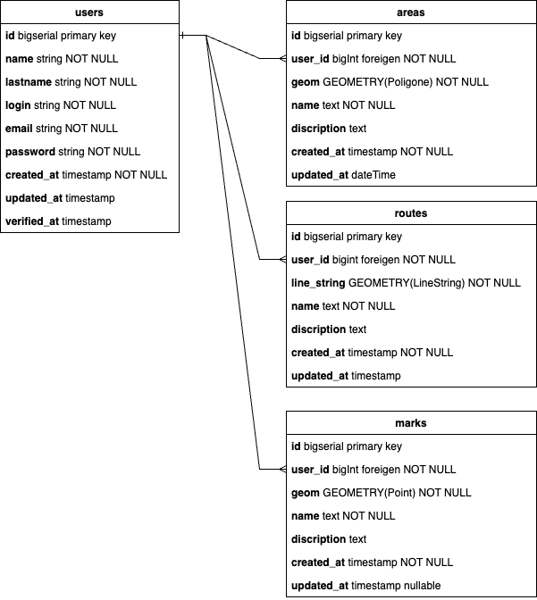

# Индивидуальное ТЗ "Инструмент для отслеживания результатов учебной езды при занятии в автошколе"

## Проблема:
- При занятиях в автошколе учащийся проезжает не все маршруты из возможных.
- Забываются трудные участки маршрутов.
- Ученик не имеет представления о районе на которому он обучается.

## Цель: 
- Создать инструмент с помощью которого ученик мог бы отметить маршруты, по которым он собирается проехать
- Сделать заметки о проблемных для него местах на которых он завалился
- Отметить знаки или сложные участки, что бы примерно иметь представление о местности по которой он передвигается
- Просмотреть карту отъезженных им маршрутов

### Список роутов:
- POST: /register Регистрация
- POST: /auth Авторизация

- POST: /routes/ Создать маршрут
- GET: /routes/ Получить список пройденных маршрутов
- GET: /routes/{id} Получить конкретный маршрут
- DELETE: /routes/{id} Удалить конкретный маршрут

- POST: /areas/ Выделить район в рамках которого проходят учебные маршруты
- PUT: /areas/{id} Изменить район в рамках которого проходят учебные маршруты
- DELETE: /areas/{id} Удалить район

- POST: /marks/ Создать на карте заметку
- POST: /marks?route_id={route_id}&area_id={area_id} Создать на карте заметку (С привязкой к маршруту и/или к области)
- PUT: /marks/{id} Изменить заметку
- DELETE: /marks/{id} Удалить заметку

### Техническая часть:
- Postgres
- MongoDB (Для хранения маршрутов, пока не знаю какой формат нужен и какие нюансы могут быть, поэтому mongo)

### Структура БД

## Запуск проекта:
- ...

## Задачи:
### Инкремент 1
- [x] Описать шаблон README.md 
- [x] Составить список задач на Инкремент 1
- [ ] Спроектировать БД
  - [ ] Описать связи основных сущностей
  - [ ] Описать взаимодействие PostgresSQL и MongoDB
- [ ] Написать миграции для базы данных
  - [ ] Для PostgresSQL
- [ ] Реализовать заглушки хендлеров
  - [ ] Описать интерфейс роутов (Передаваемые параметры)
  - [ ] Обработать исключение и возврат уодов ответов
- [ ] Запуск сервера
- [ ] Проверка подключения БД
- [ ] Определить параметры окружения и вынести их в конфиги

### Инкремент 2
- [ ] ...